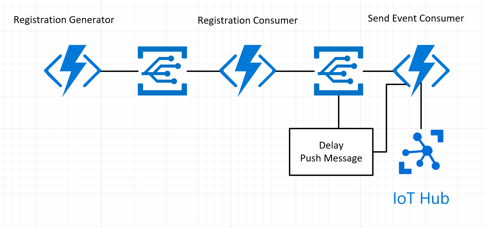

# An example device simulator using Azure Functions

[](https://portal.azure.com/#create/Microsoft.Template/uri/https%3A%2F%2Fraw.githubusercontent.com%2Fjwendl%2Ffunctions-simulator%2Fmaster%2Fdeploy%2FFunctionsSimulatorDeployment%2Fazuredeploy.json)

## Services used in this example

* [Azure Functions](https://azure.microsoft.com/en-us/services/functions/)
* [Azure Event Grid](https://azure.microsoft.com/en-us/services/event-grid/)
* [Azure IoT Hub](https://azure.microsoft.com/en-us/services/iot-hub/)
* [Application Insights](https://azure.microsoft.com/en-us/services/application-insights/)

## Other open source projects utilized in the project

* [Antlr](https://github.com/tunnelvisionlabs/antlr4cs)
* [NSubstitute](https://github.com/nsubstitute/NSubstitute)

## Current architecture

The whole goal of this application is to scale out IoT device simulation to allow for downstream reporting and machine learning tasks.

The current architecture comprises of a few Azure Functions. The first called Registration Generation, essentially parses through the HTTP POST message (see example below) and generates a durable function to iterate through each device instance and send it individually on to the second function. The second function is called the Registration Consumer function. This function essentially uses the EventGridTrigger to take an event from Event Grid and run the Device Client SDK methods to Add a Device and to update the device twin. Then it finally submits the first telemetry message to the Send Event Consumer function. This functions job is to send a message to IoT Hub, tweak the values, re-submit a message to the Event Grid for the Send Event Consumer function.

It is using Antlr 4 (see above) to take a dynamic language specification and run it against business logic built to tweak the value of the IoT Message.

Please reference the below diagram for further information.



## Example POST Message

``` bash
curl --request GET \
  --url http://localhost:7071/api/RegistrationGenerator \
  --header 'content-type: application/json' \
  --data '[
    {
        "id": "bf9260c5-54ff-436c-933c-9cb26f7a3121",
        "name": "Fridge Simulation",
        "deviceNamePattern": "Fridge-{0}-{1}",
        "deviceType": "Fridge",
        "messageType": "Telemetry",
        "initialState": "{ '\''temperature'\'': 70 }",
        "deviceInterval": 1,
        "numberOfDevices": 1,
        "propertyValues": {
            "temperature": "3+3"
        },
        "properties": {}
    }
]'
```

## Example local.settings.json

We don't "commit" this into the repo, so be sure to create this file and add the following json to it.

``` json
{
  "IsEncrypted": false,
  "Values": {
    "FUNCTIONS_WORKER_RUNTIME": "dotnet",
    "APPINSIGHTS_INSTRUMENTATIONKEY": "___",
    "AzureWebJobsStorage": "UseDevelopmentStorage=true",
    "AzureWebJobsDashboard": "UseDevelopmentStorage=true",
    "DurableTaskStorage": "UseDevelopmentStorage=true",
    "IoTHubConnectionString": "___",
    "IoTHubName": "___",
    "TopicEndpoint": "___",
    "TopicKey": "___"
  }
}
```

## How to run the application

1. Click on "Deploy to Azure" above.
1. Post a message to the function endpoint for RegistrationGenerator.
1. Go to IoT Hub or Application Insights to see the telemetry moving along.

## Debugging locally

Debugging this application locally requires the use of [NGrok](https://ngrok.com/) because of the EventGrid subscriptions. To do this, essentially open a dos prompt where you saved NGrok and type in the below command.

``` cmd
ngrok http --host-header=localhost 7071
```

Then take the url that's generated (the https one) and create an Event Grid subscription using that url.

## How to build the source code

1. Git Clone (above)
1. Open the DeviceSimulationApp.sln file
1. Hit F5

## Contribution guidelines
